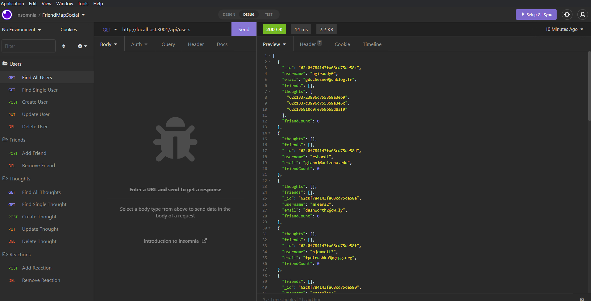

# FriendMap Social API

## Application Description 

This API is a backend application for a fictitious social networking application. FriendMap Social is an application that allows users to track their friends, share thoughts associated with their user accounts and have their friends post reactions to their shared thoughts. The API uses express nod package to handle its routing and the mongoose node package to as the Model Document Controller in its interfacing with the MongoDB.

This API will be tested using Insomnia and may be developed into a full-stack application in the future.

Check out this [link](https://www.youtube.com/watch?v=720FHxpC5Uw) and the link to the github repository is [here](https://github.com/ChannellNumber5/CR-FriendMapSocial) to the tutorial

## Table of Contents
- [Steps for Install](#steps-for-install)
- [Usage Instructions](#user-instructions)
- [Contributions](#contribution-guidelines)
- [Test Instructions](#test-instructions)
- [Licensing](#licensing)
- [Questions](#questions)

## Steps for Install
Because this is a back-end API application, it must be tested/used with [Insomnia](https://insomnia.rest/) to connect to the routes and the input of data into the database. In order to use the application, users will need to do a node package manager install, to install the dependencceis and then will need to install and use insomnia to test/run the routes.

## User Instructions
Check out the link to the tutorial link above and here is a screenshot of tests in Insomnia:

## Contribution Guidelines
The UW Coding Bootcamp is credited with this application idea. Christina Robinson coded out this project and you can find my github link below or find me on linkedIn [here](https://www.linkedin.com/in/channellnumber5/)

## Test Instructions
The application should be used/tested in insomnia.

## Licensing
This project is covered under the MIT license. Here is the [link](https://opensource.org/licenses/MIT) for more information about this license type.

## Questions
If you have additional questions you contact via GitHub at [ChannellNumber5](https://github.com/ChannellNumber5). Also, you can email your inquiries to [CLRCoding@gmail.com]("mailto:CLRCoding@gmail.com").

## Resources

- [Server.js vs. app.js vs. index.js](https://stackoverflow.com/questions/36002413/conventions-for-app-js-index-js-and-server-js-in-node-js)
- [process.cwd()](https://www.geeksforgeeks.org/node-js-process-cwd-method/)
- [useNewUrlParser Needed?](https://mongoosejs.com/docs/migrating_to_6.html#no-more-deprecation-warning-options)
- [regular expressions 101](https://regex101.com/)
    - used this site to test then modify my first attempt at an email address verification regex
- [Regex Matching](https://howtodoinjava.com/java/regex/match-any-set-of-characters/)
    -helpful site to clarify matching multiple characters
- [Mongoose Getters/Setters](https://mongoosejs.com/docs/tutorials/getters-setters.html)
- [findByIdAndDelete vs findByIdAndRemove](https://stackoverflow.com/questions/61451862/whats-the-difference-between-remove-and-delete-in-mongodb-updates)
- [Mongoose deleteMany()](https://mongoosejs.com/docs/api.html#model_Model.deleteMany)
